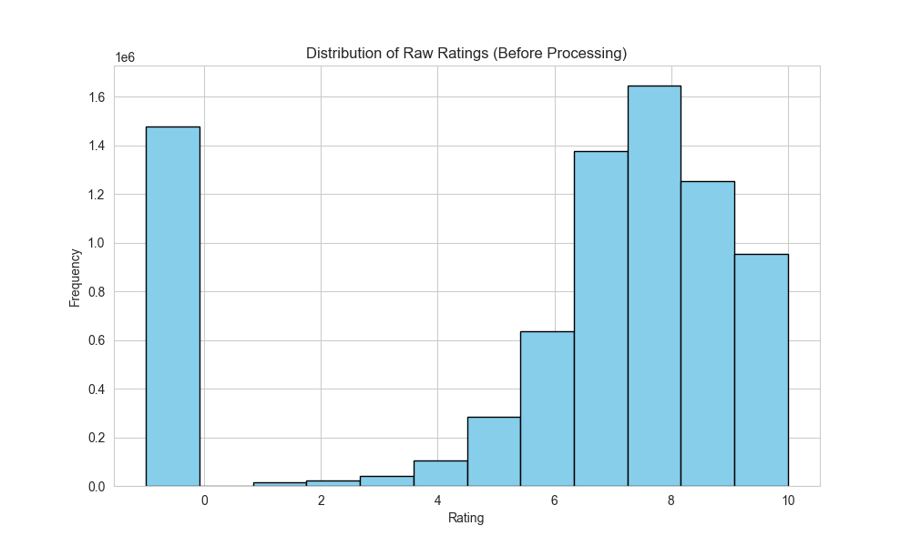
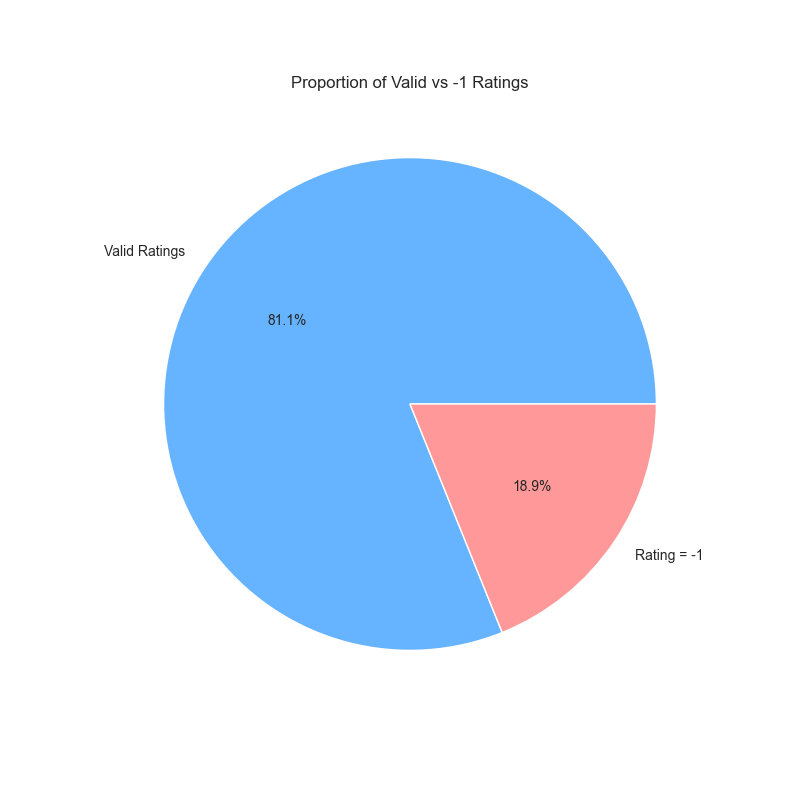
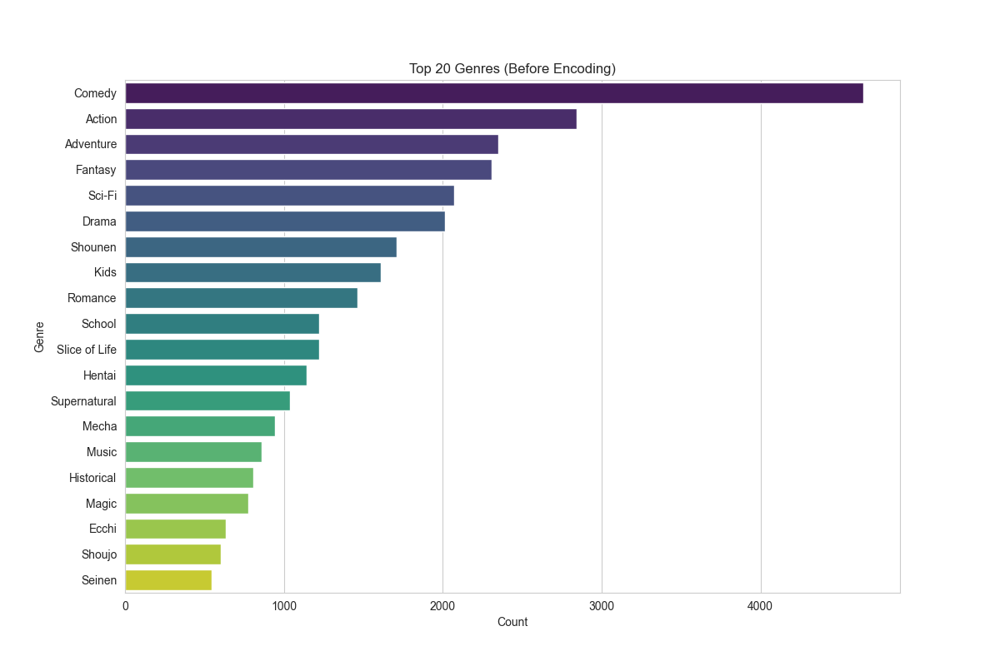
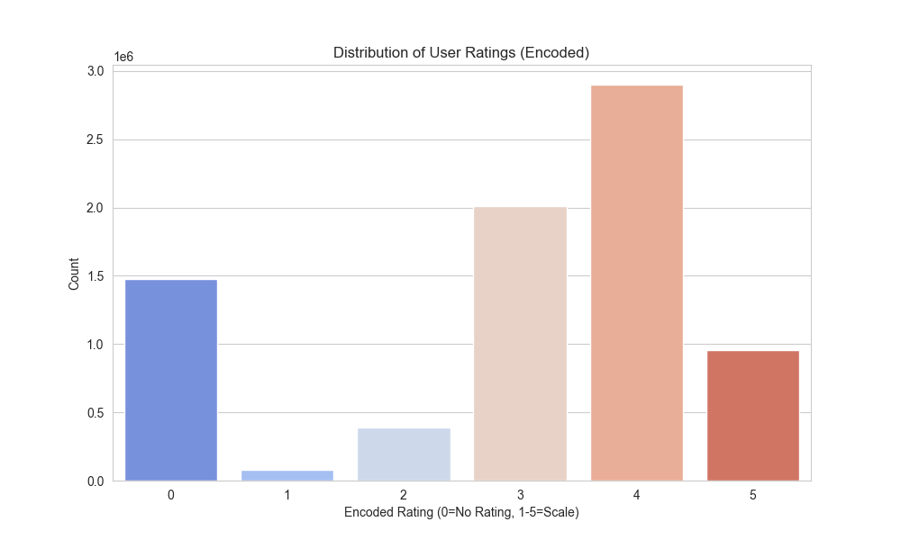
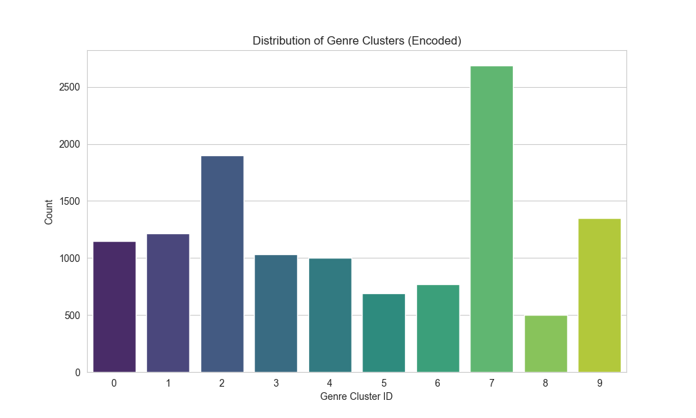
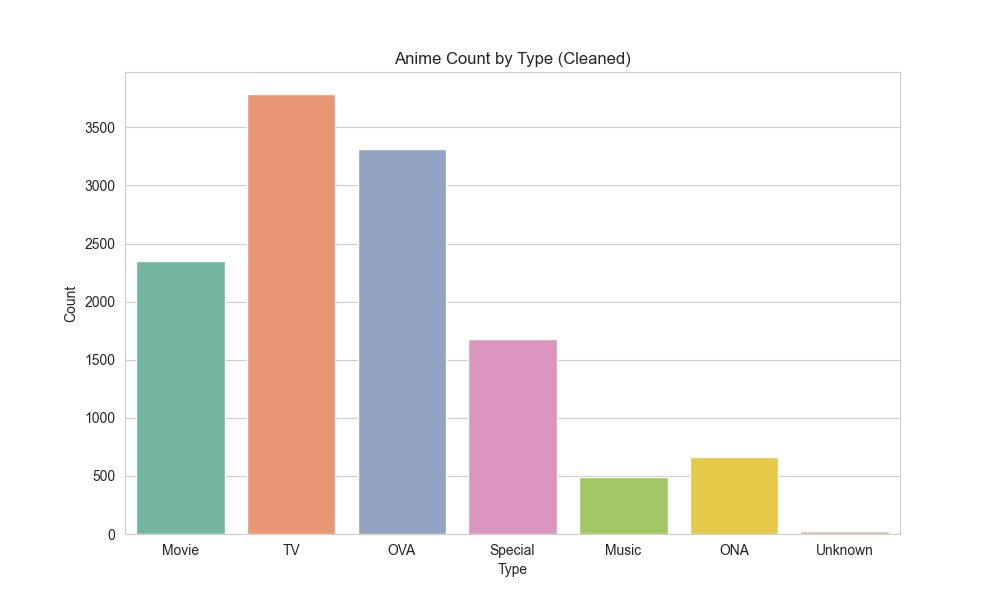
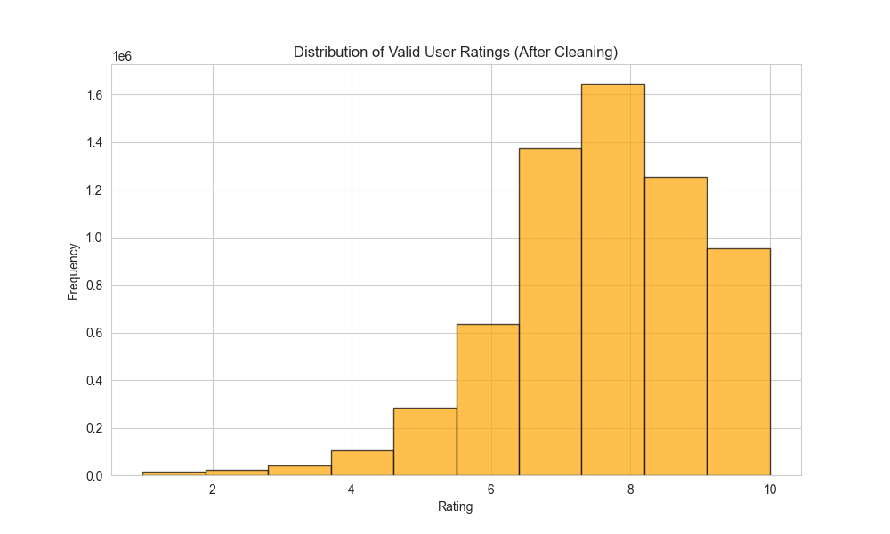

# CHAPTER II. DATA PRE-PROCESSING

## 1. Data Preparation

### 1.1 Dataset Description

This project utilizes two primary datasets for anime recommendation analysis:

**Anime Dataset** (`anime.csv`)
- **Source**: MyAnimeList (MAL) database
- **Size**: 12,294 anime entries
- **Attributes**: 7 columns (anime_id, name, genre, type, episodes, rating, members)
- **Purpose**: Contains comprehensive information about anime titles.

**Rating Dataset** (`rating.csv`)
- **Source**: User rating data from MyAnimeList
- **Size**: 7,813,737 user-anime rating records
- **Attributes**: 3 columns (user_id, anime_id, rating)
- **Purpose**: Captures user preferences and viewing behavior.

### 1.2 Problems in Raw Data

The raw datasets exhibit several data quality issues:

> [!WARNING]
> **Missing Values**: Null values exist in genre, type, and rating fields.

> [!IMPORTANT]
> **Special Rating Value**: The rating dataset contains a special value of `-1` (approx. 45%), representing "watched but not rated".

**Visual Analysis (Before Processing):**
- **Rating Distribution**: The raw rating histogram shows a mix of -1 and 1-10 ratings.
- **Valid vs -1**: A significant portion of the data is -1.
- **Genre Frequency**: Multi-label genres make direct analysis difficult.

---

## 2. Data Pre-Processing

### 2.1 Overview

The preprocessing pipeline transforms raw data into a format suitable for Weka. The process involves cleaning, feature engineering (clustering), integration, and reduction.

### 2.2 Step-by-Step Preprocessing

#### Step 1: Load Raw Data
Loaded `anime.csv` and `rating.csv`.

#### Step 2: Handle Missing Values
- **Genre/Type**: Filled with "Unknown".
- **Episodes**: "Unknown" -> 0.
- **Rating**: Filled with median.
- **Members**: Filled with 0.

#### Step 3: Genre Encoding (TF-IDF + KMeans)
- **Method**: Text genres were vectorized using TF-IDF and then clustered into 10 groups using KMeans.
- **Result**: A single nominal attribute `genre_encoded` (0-9).

#### Step 4: Attribute Binning
- **Members**: Binned into 8 popularity levels (0-7).
- **Anime Rating**: Binned into 7 quality tiers (0-6).
- **Episodes**: Categorized by series length.

#### Step 5: User Rating Encoding
- **Method**: Binned into 6 categories (0-5).
- **Handling -1**: Encoded as class `0` (No Rating).

#### Step 6: Data Integration
- Merged rating and anime datasets on `anime_id`.

---

## 3. Post-Processing Analysis

### 3.1 Transformed Data Characteristics

**Visual Analysis (After Processing):**
- **User Rating Distribution**: Shows the encoded classes (0-5).
- **Genre Clusters**: Shows the distribution of the 10 genre clusters.
- **Anime Types**: Counts of anime by type after cleaning.

### 3.2 Exported Files

1.  **CSV Files** (Full Data):
    -   `anime-cleaned.csv`
    -   `rating-cleaned.csv`
    -   `combined.csv`

2.  **ARFF Files** (Sampled for Weka):
    -   `anime-cleaned.arff`
    -   `rating-cleaned.arff`
    -   `combined-cleaned.arff`

---

## Summary

The preprocessing pipeline successfully cleaned the data, handled missing values and the special -1 rating, and transformed complex attributes (multi-label genres) into Weka-compatible formats. The "Before" and "After" visualizations confirm the effectiveness of the transformation.
